# Your Bike Admin App

A simple flutter application for an admin user that will be used for show, add, update & delete
operations for bikes.

## Tools and Technologies:

1. Framework: flutter-3.22.2
2. Programming language: dart-3.4.3
3. IDE: android studio-koala | 2024.1.1

## Packages:

1. http: ^0.13.6
2. flutter_riverpod: ^2.3.7
3. hive: ^2.2.3
4. path_provider: ^2.1.1
5. image_picker: ^1.0.4

## Features:

1. Authentication
2. bike list
3. bike details
4. bike details edit
5. bike delete
6. notification list
7. read notification

**bakcend project repository link:** https://github.com/Neloy-SWE/Your-Bike-Admin-Backend

to run the flutter app, you need to setup the backend first. you may find details about the backend
project in it's **readme.md** file.

## Screenshots:

  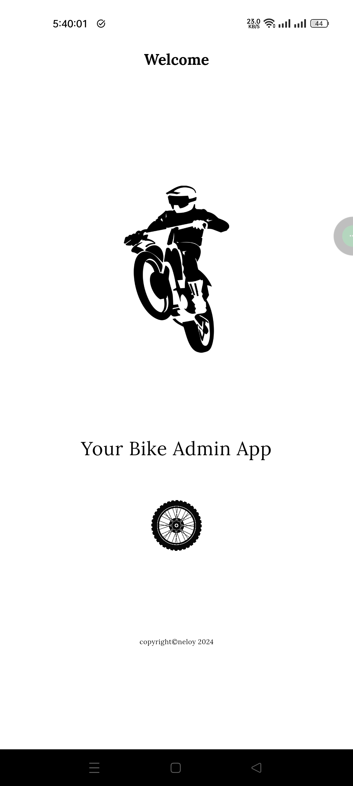
  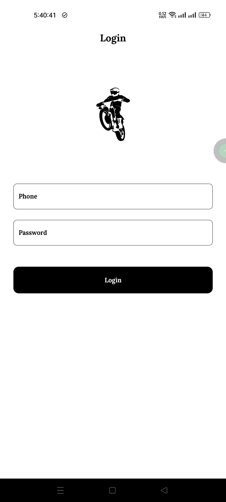
  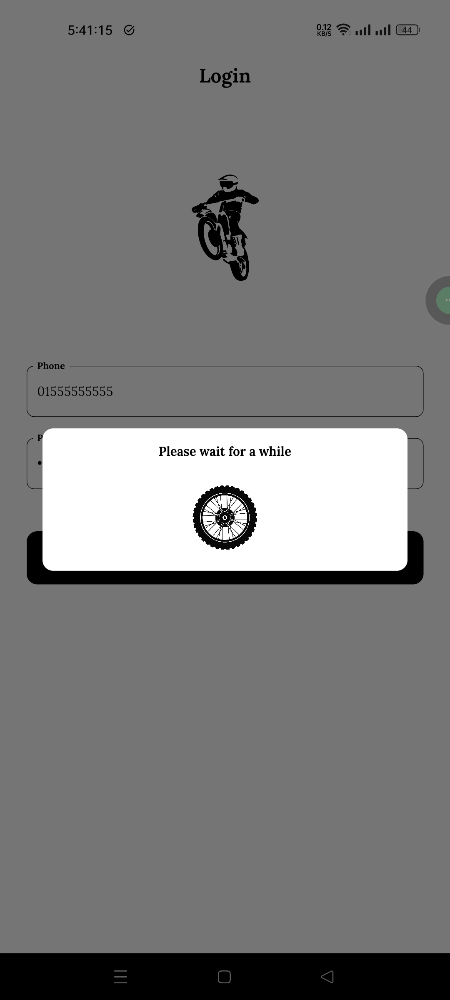
  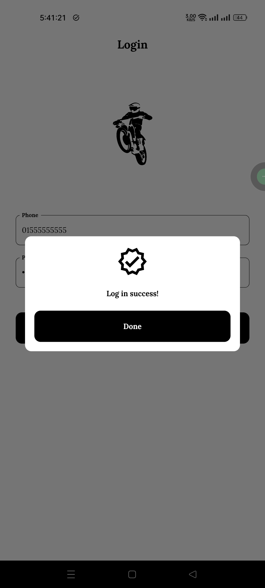
  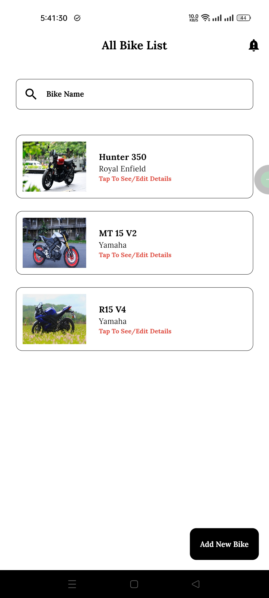
  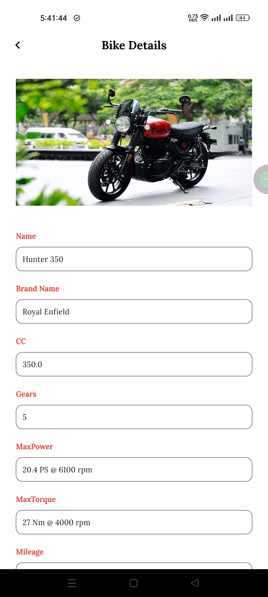
  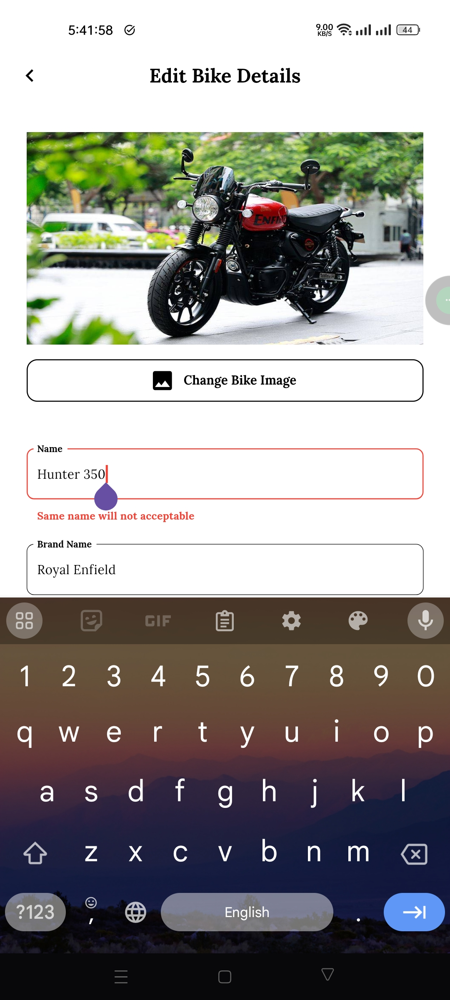
  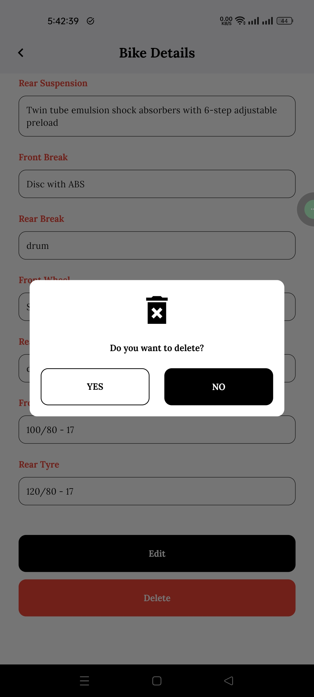
  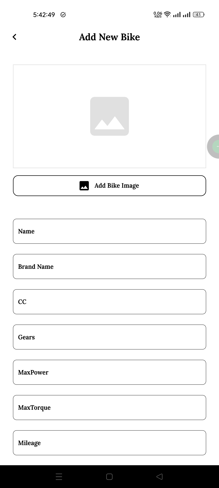
  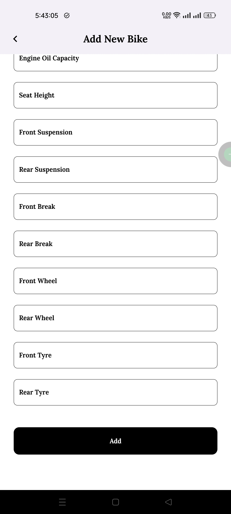
  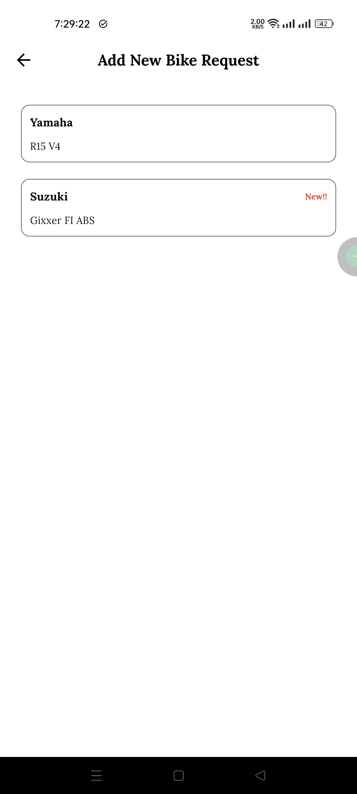
  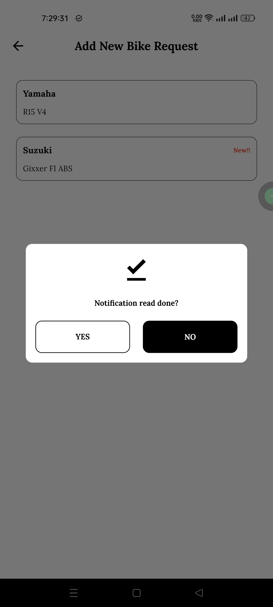
  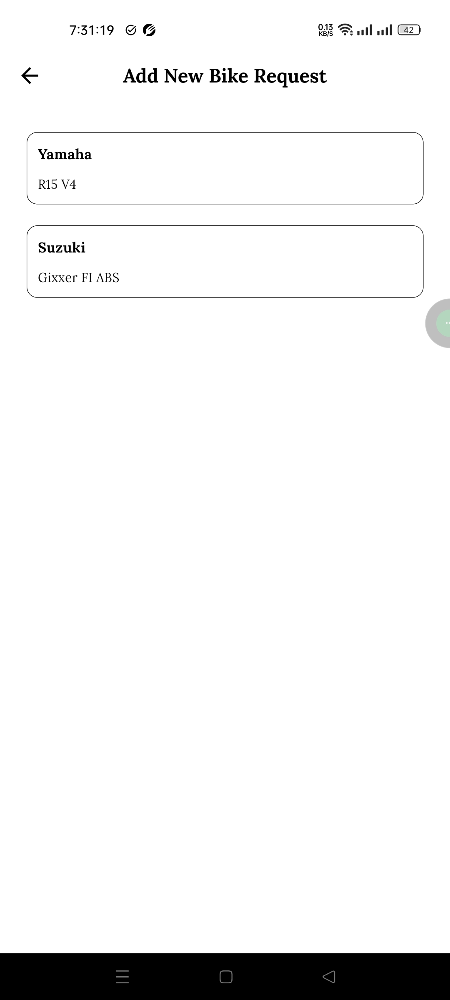